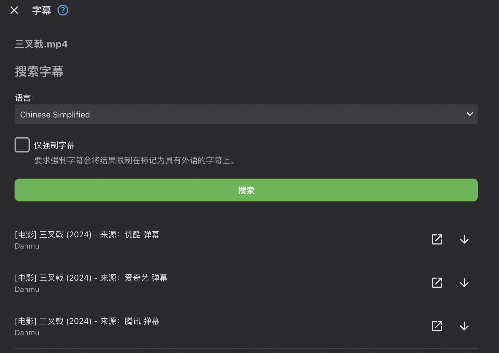

# 因为本人自己不再使用EMBY, 不同环境自己调试和解决兼容问题
### 请喝咖啡


## 2025-04-23更新
1. 修复爱奇艺弹幕下载问题
2. 支持更新和扫描任务


## 2024-07-26更新
1. 支持弹幕搜索
2. 支持新增媒体自动下载

## 支持弹幕网站
目前只支持以下站点，后续有空再更新
```
弹弹play、爱奇艺、腾讯、优酷
```
设置方式一样和jellyfin一样 [参考](https://github.com/cxfksword/jellyfin-plugin-danmu) ，但是api接口基本没有支持


## 支持的api操作
```shell
## 刷新某个媒体的弹幕
/api/danmu/{媒体id}?option=Refresh&X-Emby-Token=xxx
## 获取媒体对应json格式弹幕
/api/danmu/{媒体id}?option=GetJsonById&X-Emby-Token=xxx

```

## 下载链接
[Emby.Plugin.Danmu.dll](https://github.com/fengymi/emby-plugin-danmu/releases/tag/1.0.0) <p/>
[Emby.AndroidTV.2.1.14.弹幕.apk](https://github.com/fengymi/emby-plugin-danmu/releases/tag/1.0.0)

## 遗留问题
1. 配置暂不支持顺序调整

### 预览


